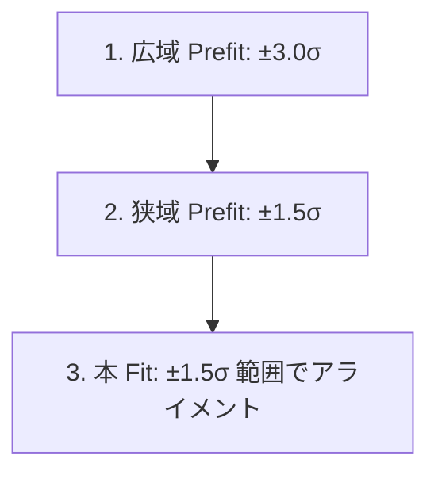

# Cf-252 中性子・ガンマ線飛行時間(TOF)および遅延同時計数解析レポート

本ドキュメントは、Cf-252 線源を用いた飛行時間（TOF: Time-of-Flight）測定データに対するスルーイング補正、運動エネルギー変換、および中性子捕獲遅延同時計数（Coincidence）による減衰時定数のフィット解析について、使用した物理式、アルゴリズム、およびフィッティングの技術的詳細をまとめたものである。

---

## 1. TOF解析と自動スルーイング補正 (tof_analysis)

### 1.1. スルーイング効果と補正公式
光電増倍管（PMT）やシンチレータを用いた検出器システムにおいて、ディスクリミネータによる時間測定では、波高（チャージ $Q$）が小さい信号ほど閾値に達するまでの時間が遅れるため、測定される時間情報に遅れが生じる。これを**スルーイング効果（Slewing Effect）**と呼ぶ。

基準チャージにおける時間測定のばらつきを補正するため、以下の関係式を用いて測定された検出時間 $T$ から補正時間 $T_{\text{corr}}$ を算出する：

$$T_{\text{corr}} = T - \frac{p_0}{\sqrt{Q}}$$

ここで、$Q$ は測定された波高チャージ値（チャンネル）、$p_0$ は検出器固有のスルーイング補正係数である。本解析では、ガンマ線ピークがチャージに依存せず時間軸上で一対一に整列（アライメント）されるように $p_0$ を決定する。

### 1.2. 3段階フィッティングによる補正係数の自動決定
スルーイング補正係_ $p_0$ を自動で高精度に探索するため、以下の3ステップフィッティングアルゴリズムを実装している。

1. **第1段階 (広域 Prefit)**:
   * 初期パラメータ（ピーク位置、高さ、$\sigma = 2.0$ ns）を設定し、ピークトップから $\pm 3.0\sigma$ の広域範囲でガウシアンを用いてフィットを行い、ピークの中心値と標準偏差（$\sigma$）の概略値を決定する。
2. **第2段階 (狭域 Prefit)**:
   * 1段階目の結果を用いてフィット範囲を $\pm 1.5\sigma$ に絞り込み、裾野のノイズの影響を排除した高精度なピーク位置（$\mu$）および標準偏差（$\sigma$）を再決定する。
3. **第3段階 (本フィット)**:
   * 2段階目で得られたアスペクト比に基づき、各チャージ領域におけるガンマ線のピーク位置が均一になるように最小二乗法を用いてフィッティングし、最終的なスルーイング補正係数 $p_0$ を決定する。

#### 中性子ピークフィット時の保護ロジック
中性子ピークはガンマ線と異なり裾野が広く非対称な分布を持つため、広域の prefit を複数回行うとガンマ線の急峻なピークを巻き込んでフィッティングが破綻する。
これを防ぐため、中性子に対しては **「Prefit を1回のみ」** とし、さらに本フィット範囲の左境界をガンマ線が混入しないように以下のクリップガードを適用してガードしている：

$$\text{Fit Left Limit} = \max\left(60.0\text{ ns}, \ \mu_{\text{pre}} - 1.5\sigma_{\text{pre}}\right)$$

---

## 2. 相対論的運動エネルギーへの変換

スルーイング補正後の飛行時間 $\text{TOF}_{\text{corr}}$ を用いて、中性子の相対論的運動エネルギー $E_k$ への変換を行う。

### 2.1. 物理公式
中性子の質量を $m_n = 939.565\text{ MeV}/c^2$、飛行距離を $L = 1.0\text{ m}$、真空中の光速を $c = 0.299792\text{ m/ns}$ とする。

1. **無次元速度 $\beta$**:
   
   $$\beta = \frac{v}{c} = \frac{L}{c \cdot \text{TOF}_{\text{corr}}}$$

2. **ローレンツ因子 $\gamma$**:
   
   $$\gamma = \frac{1}{\sqrt{1 - \beta^2}}$$

3. **相対論的運動エネルギー $E_k$**:
   
   $$E_k = m_n c^2 (\gamma - 1)$$

### 2.2. 実装上の処理
* $\beta \ge 1.0$ となるような物理的にあり得ないイベント（または超光速イベント）は変換時の実数エラー（Nan）を防ぐため自動的にフィルタリングされる。
* 変換後の中性子運動エネルギー分布は、`0 ~ 15 MeV`（75分割, 1bin = 0.2 MeV）の黒線ヒストグラムとして出力される。

---

## 3. 遅延同時計数（コインシデンス）解析 (coincidence_analysis)

### 3.1. トリガー時間窓（タイムゲート）選別
先行事象（Fast 検出器など）と後発事象（Slow 検出器など）の間の時間差に基づいて中性子捕獲反応ペアを抽出する。

* **選別窓の定義**:
  スルーイング補正を行わない生の $T0, T1$ に基づくトリガー窓として、以下を設定する：
  
  $$60.0\text{ ns} \le T_1 - T_0 \le 120.0\text{ ns}$$

* **可視化**:
  ロードした全数百万規模の生イベントに対し、$T_1 - T_0$ のヒストグラムを描画し、上記選別窓の上限・下限に赤い点線（`TLine`）を引いた PDF（`*_coincidence_trigger.pdf`）を自動生成する。

---

## 4. $Q_1$ ゲートごとの減衰時定数フィッティング (coincidence_fit)

捕獲反応の種類（Li 捕獲、核子捕獲など）による捕獲時定数 $\tau$ の違いを検証するため、捕獲された検出チャージ `slow_Q1` に応じたゲートでデータをスライスし、時間差スペクトルをフィッティングする。

### 4.1. $Q_1$ チャージゲートの切り方
統計精度と物理的解像度のバランスを考慮し、以下の不均等なスライスゲートを構成する（上限 $Q_1 = 50$）：
* **$0 \sim 20$ まで**: 5刻み（`0-5`, `5-10`, `10-15`, `15-20`）
* **$20 \sim 50$ まで**: 10刻み（`20-30`, `30-40`, `40-50`）

### 4.2. フィッティングモデル
時間差 $\Delta t$ の分布に対して、以下の「定数背景付き指数減衰関数」をフィットする。

$$f(t) = A e^{-t/\tau} + B$$

* $A$ (`[0]`): 減衰成分の初期振幅
* $\tau$ (`[1]`): 減衰時定数（標準的な熱化中性子捕獲寿命）
* $B$ (`[2]`): 定常バックグラウンドレベル

### 4.3. 数学的・統計的な最適化手法
本解析では、パラメータ間の強い相関によるエラーの爆発（誤差値の過大評価）を防ぐため、以下の数学的・統計的アプローチを統合している。

#### ① ポアソン対数尤度フィット (Log-Likelihood Fit)
通常の $\chi^2$ 最小二乗法ではなく、ポアソン分布に基づいた対数尤度法（ROOT の **`L` オプション**）を使用する。これにより、統計数の少ない後半ビンにおける統計ゆらぎが正しく評価され、フィッティング精度とエラー（$\tau_{\text{err}}$）の決定精度が極めて高くなる。

#### ② 2段階フィッティング
1回目のフィット結果（暫定収束パラメータ）を初期値として Minuit に引き継がせた状態で、2回目の本フィットを行う。これにより、極小値の谷が平らなパラメータ空間であっても、Minuit が正確にベストフィット点と共分散行列を決定できるようになる。

#### ③ 800〜900 $\mu$s テール領域による背景 $B$ の精密推定と境界制約
バックグラウンド $B$ の推定に、フィット表示範囲（`0 ~ 800` $\mu$s）の外側にあたる最も安定した **`800 ~ 900` $\mu$s の平均値**を使用する。
一時ヒストグラムのビン幅（10 $\mu$s/bin）と本ヒストグラムのビン幅（8 $\mu$s/bin）のスケール差を埋めるため、以下のスケール係数を用いて `bg_est` を算出する：

$$\text{bg\_est} = N_{\text{integral}(800-900\mu\text{s})} \times 0.08$$

この $B_{\text{est}}$ に対して、フィット中に **$\pm 10\%$ 以内の微調整のみを許可** する境界制限を設定する：

$$\text{bg\_min} = \max\left(0, \ B_{\text{est}} \times 0.9\right) \le B \le B_{\text{est}} \times 1.1 + 1.0 = \text{bg\_max}$$

これにより、振幅 $A$ や時定数 $\tau$ との不要なパラメータ相関（多重共線性）が完全にシャットアウトされ、時定数 $\tau$ のエラーが数 $\mu$s 程度の極めて綺麗な値に収束する。

#### ④ 振幅の正値ガード
初期振幅パラメータの境界エラー（ROOT の ParameterSettings 警告）を防ぐため、振幅 of initial value に以下のガードを適用する：

$$\text{amp\_init} = \max\left(1.0, \ \text{local\_max} - \text{bg\_est}\right)$$

---

## 5. 解析出力PDFの構成

フィッティング完了後、以下の3つの PDF ファイルが生成され、解析の成否を確認できる。

1. `*_tof_analysis.pdf`
   * 1-4p: 各種 1D/2D タイムスペクトルプロット
   * 5-6p: スルーイング補正値（$p_0$）の個別フィット結果（右側に誤差付き数値出力）
   * 7p: 相対論的運動エネルギー分布スペクトル
2. `*_coincidence_trigger.pdf`
   * 選別前の全イベントに対する $T_1 - T_0$ タイムスペクトルと、選別窓を示す赤点線
3. `*_coincidence_fit_results.pdf`
   * 1-2p: 各 $Q_1$ ゲートごとの時間差 $\Delta t$ の 2x2 分割フィットプロット
   * 3p: **全 $Q_1$ 合算（がっちゃん子）フィットプロット**
   * 4p: 時定数 $\tau$ の $Q_1$ 依存性グラフ（$Q_1$ vs $\tau$ の `TGraphErrors` プロット）
